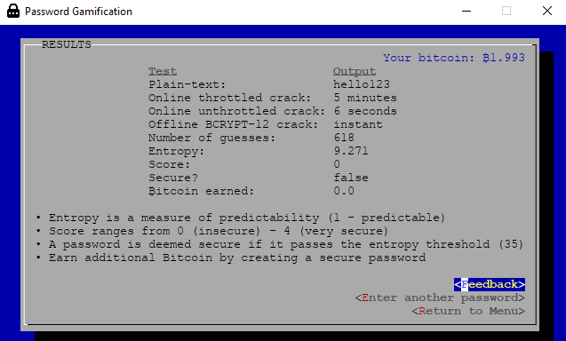

# Password Security Gamification

#### Abstract
As we plunge deeper into the information era, society has become increasingly reliant on the internet for many services. The first line of defence to safeguard information resources from unauthorised access is password authentication, but despite is prevalence, its best practice is not often followed and the use of weak passwords persist. 

Gamification is a recent technique that has emerged in the last decade and has proven to be particularly successful in improving user experience through simple psychology. It is a powerful tool that roots the idea of using game elements in non-game contexts to reach objectives while increasing user engagement and motivation.

#### Practical
The aim of this project is to combine the benefits of gamification with password security in order to reinforce the value and practice of strong passwords. If you would like to take part, please carry out the following instructions:

 1. Read through the [Information Sheet](readme/Information_Sheet.pdf) and complete the [Consent Form](readme/Consent_Form.pdf)
 2. Complete the [Pre-game questionnaire](https://forms.gle/yEsgoV8erPifGp4E7)
 3. Download and play the [game](readme/PasswordGamification.jar) on your local machine
    * To start the game, simply double-click the jar file once it has finished downloading
    * Mac users will have to allow opening of unsigned apps
    * If the game does not start by double-clicking the jar file, make sure you have [Java](https://www.oracle.com/java/technologies/javase-jdk14-downloads.html) installed on your platform
 4. Complete the [Post-game questionnaire](https://forms.gle/yrPyKKybU4wmvyHZ7)
 
 ### Thank you!
 
 ------
 
 #### This research has been concluded. The paper can be viewed [here](readme/Research_Paper.pdf).
 
 ## Screenshots
 
 

  
  
   
  
  
  
  
  

